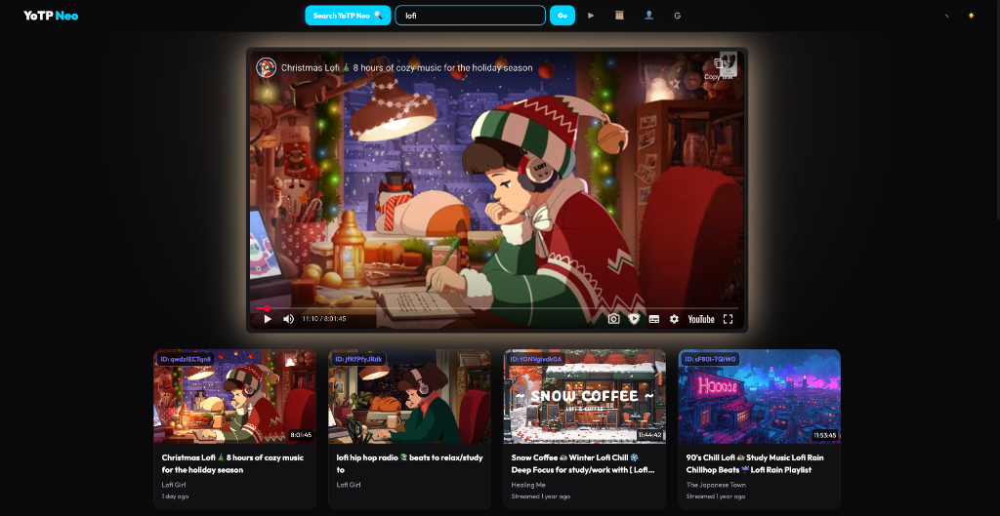

# YoTP Neo 💎

> **The Ultimate YouTube Player for Restricted Networks.**
> *Premium Aesthetics. Bulletproof Search. Zero Distractions.*

---

## 🚀 Experience the Neo Era

**YoTP Neo** (formerly YouTubePlayer) is a complete modernization of a decade-old classic. Rebuilt from scratch with **React + Vite**, it combines a "Neural Glass" aesthetic with robust privacy and search features designed to work where others fail.

### ✨ Key Features

*   **🎨 Neural Glass UI**: A stunning, dark-themed interface with glassmorphism, blur effects, and smooth transitions.
*   **💡 Living Ambient Glow**: The player emits a dynamic, pulsing glow that matches the color of the video thumbnail (Server-Side Proxy included).
*   **🔍 Bulletproof Search**:
    *   **Direct Scraper**: Bypasses API limitations by scraping locally.
    *   **Legacy Google Search**: Includes the classic Google CSE integration as a fallback.
    *   **Instant Results**: Fast, grid-based results with no clutter.
*   **🛡️ Privacy First**:
    *   **Obfuscated Source**: Critical logic is hidden in the source code.
    *   **Ghost Footer**: Invisible UI that only appears when needed.
    *   **One-Click Reset**: Instantly nuke all local data.
*   **📱 Fully Responsive**: Optimized for everything from ultrawide desktops to mobile phones.
*   **🎭 Cinema Mode**: Press `T` to focus. The world fades away.
*   **🎬 Native HD Preference**: Force-starts videos in Full HD (1080p) automatically.

---

## 🛠️ Tech Stack

*   **Frontend**: React 19, Vite, Vanilla CSS (Variables & Animations).
*   **Backend**: Node.js, Express (for Image Proxy & Search Scraper).
*   **Deploy**: Render / Railway (Node Environment).

---

## 📦 Deployment

This project requires a **Node.js active server** to function (for the proxy). It cannot be hosted on static sites like GitHub Pages.

### Recommended: Render.com
1.  Fork/Clone this repo.
2.  Create a **Web Service** on Render.
3.  Connect the repo.
4.  Settings:
    *   **Build Command**: `npm install && npm run build`
    *   **Start Command**: `npm start`
5.  Deploy.

---

## 🎹 Shortcuts

| Key | Action |
| :--- | :--- |
| **`T`** | Toggle Cinema Mode |
| **`Esc`** | Exit Cinema Mode |
| **`/`** | Focus Search (Coming Soon) |

---

